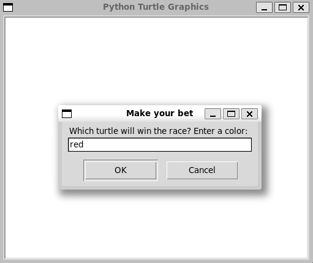
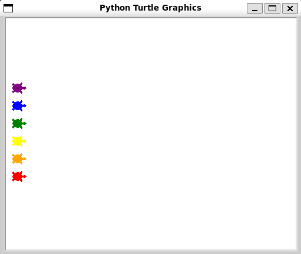
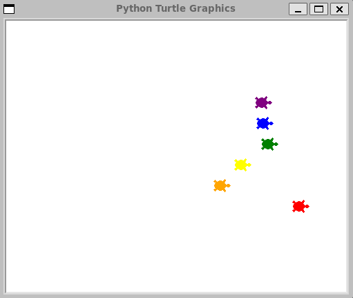

# Turtle Racing Game

Race colorful turtles and place your bet on the winner in this interactive turtle racing game using Python's Turtle graphics library.

## Description

This Python program simulates a turtle race where you can place a bet on one of the colorful turtles. The race continues until one of the turtles reaches the finish line, and the winner is announced. The outcome depends on both chance and your choice of the winning turtle's color.

## Getting Started

### Prerequisites

- Python 3.x
- Turtle graphics library (usually included in Python standard library)

### Usage

1. Run the Python script:

   ```
   python main.py
   ```

## Screenshots




   
## License

This project is licensed under the MIT License.

## Acknowledgments

- This project was inspired by the [App Brewery's](https://www.appbrewery.co/) Python course on Udemy.